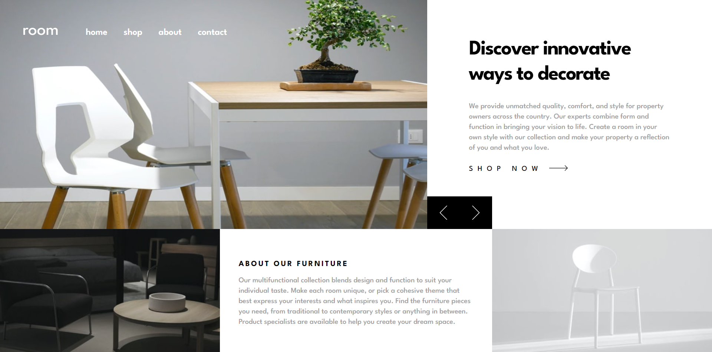

# Frontend Mentor - Room homepage solution

This is a solution to the [Room homepage challenge on Frontend Mentor](https://www.frontendmentor.io/challenges/room-homepage-BtdBY_ENq). Frontend Mentor challenges help you improve your coding skills by building realistic projects. 

## Table of contents


  - [The challenge](#the-challenge)
  - [Screenshot](#screenshot)
  - [Links](#links)
  - [Built with](#built-with)
  - [What I learned](#what-i-learned)
  - [Useful resources](#useful-resources)
  - [Author](#author)


### The challenge

Users should be able to:

- View the optimal layout for the site depending on their device's screen size
- See hover states for all interactive elements on the page
- Navigate the slider using either their mouse/trackpad or keyboard

### Screenshot




### Links

- Solution URL: [Add solution URL here](https://your-solution-url.com)
- Live Site URL: [Add live site URL here](https://your-live-site-url.com)


### Built with

- Semantic HTML5 markup
- CSS custom properties
- Flexbox
- Mobile-first workflow

### What I learned

Use this section to recap over some of your major learnings while working through this project. Writing these out and providing code samples of areas you want to highlight is a great way to reinforce your own knowledge.

To see how you can add code snippets, see below:

```html
<h1>Some HTML code I'm proud of</h1>
```
```css
/* Animated nav link hover underline using ::before or ::after */
/* keypoint: position and display of the link */
nav ul li {
    display: inline-block;
    position: relative;
}
nav ul li::after {
    transition: .3s;
    position: absolute;
    content: "";
    width: 0%;
    height: 2.4px;
    bottom: -10px;
    left: 0;
    right: 0;
    margin: auto;
    background-color: var(--white);
}
nav ul li:hover::after {
    width: 50%;
}
```
```js
// Help to achieve the effect of turning over slides, e.g landing homepage
element.nextElementSibling.classList.add();
```


### Useful resources

- [codepen from Shawn Reisner](https://codepen.io/sreisner/pen/yOOOjx) - This helped me with making animated nav link hover underline.
- [github from jarekTerejko](https://github.com/jarekTerejko/fem-challenges-solutions/blob/main/room-homepage-master/script.js) - This helped me a lot with understanding the homepage slides logic in javascript.


## Author

- Website - [Wanxia Xie](https://www.your-site.com)
- Frontend Mentor - [@awsmPuff](https://www.frontendmentor.io/profile/awsmPuff)


